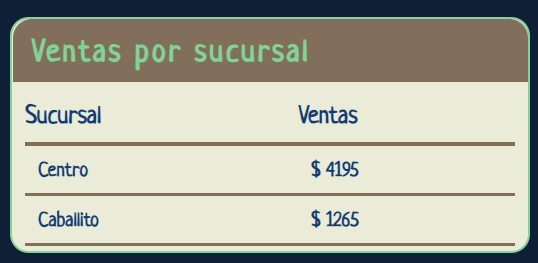
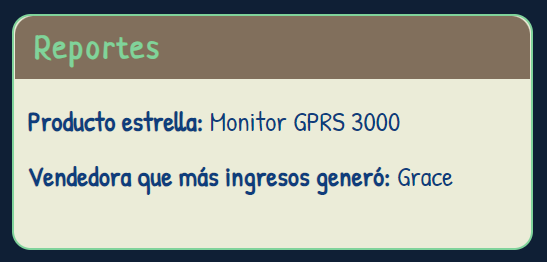
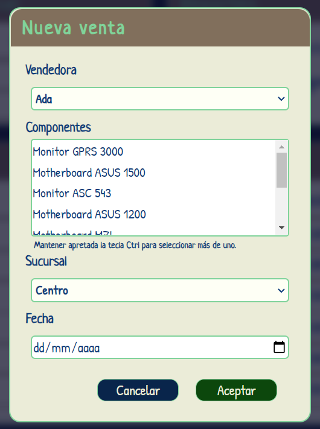
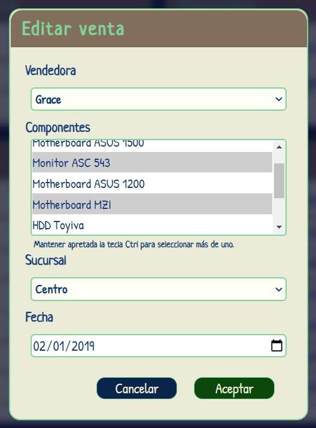
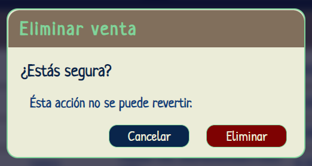

# Administrador de Ventas

Bienvenidos a mi proyecto más grande... Hasta la fecha :) 

Éste es el segundo trabajo práctico a entregar en el curso de Fundación ADA. El mismo consiste en un CRUD de ventas (Crud hace referencia a Create, Read, Update, Delete o "crear, leer, actualizar, borrar" en español).

Está diseñado en HTML, CSS y JavaScript puro, éste proyecto no involucra ninguna librería externa.

El sistema de adición, edición y eliminación de datos en éste proyecto se basa en un array de objetos incluido dentro de la lógica del mismo (pueden consultarlo [aquí](https://github.com/BlackmistBasset/Administrador-de-ventas/blob/main/js/data.js)). Por ende, ningún cambio es permanente y solo se verá reflejado en tanto no se recargue la página. Al recargar, indiferentemente de lo que se haya modificado antes, se volverá al mismo estado inicial de 20 ventas de muestra.

## Funcionalidades:

### Ventas por sucursal

La sección de ventas por sucursal detalla la lista de sucursales disponibles y cuanto vendió cada una. Se actualiza automáticamente al crear, editar o eliminar una venta.

 

### Reportes

En la sección de reportes se puede ver quién es la vendedora que vendió el mayor monto, así como el producto que más veces fue vendido. Se actualiza automáticamente al crear, editar o eliminar una venta.

### Tabla de ventas
En la tabla se detalla la informacion de todas las ventas realizadas. Los datos que se tienen en cuenta son:

* La fecha en que fue realizada la venta
* La vendedora que gestionó la venta
* La sucursal donde se realizó la venta
* Los componentes que conformaron la venta
* El precio total resultante de la suma del precio de cada uno de esos componentes

Además, se encuentran en la tabla dos botones: Editar y Eliminar, que permiten gestionar cada venta individualmente. 

### Otras funcionalidades

* Todas las ventas se ordenarán en la tabla según su fecha, independientemente de cuando hayan sido agregadas o si la fecha fue editada posteriormente.
* El sistema no permite la carga o edición de ventas cuya fecha sea nula o posterior a la fecha actual. Tampoco aquellas ventas en las que falte algún dato.

## Acciones:

### Nueva Venta

El sistema permite añadir nuevas ventas. Al hacer click en el botón "nueva venta", se desplegará una ventana modal para cargar los datos de la misma:

Si se ingresan datos válidos en todos los campos, la nueva venta se verá reflejada en la tabla (no olvidar que se ordenan según la fecha de la venta). 

Si algún campo queda vacío o se introduce una fecha futura, se desplegará un Alert notificando el error, para poder corregirlo.

Al añadirse la nueva venta, automáticamente se actualizarán los reportes de ventas por sucursales, y si es necesario, la mejor vendedora y el componente más vendido.

### Editar Venta

De ser necesario, es posible modificar los datos de una venta ya creada.

Los datos de la venta seleccionada para modificar aparecen pre-cargados en la ventana modal. 

Ésta funcionalidad posee la misma validación que Nueva Venta: Es necesario completar todos los campos e introducir una fecha válida para que se reflejen los cambios. 

Los reportes por sucursal, así como la mejor vendedora y el componente más vendido, también se actualizan de forma automática al editar una venta.

### Eliminar Venta

También es posible eliminar ventas de la tabla. Al presionar el botón eliminar, se desplegará una ventana modal pidiendo confirmación:

Tal cual advierte la modal, ésta acción no puede revertirse. 

Al aceptar, la venta desaparecerá de la tabla, y se actualizarán las ventas por sucursal, la mejor vendedora y el componente más vendido.

## En resumen 
Hasta la fecha, éste fue mi proyecto más grande y también ambicioso, ya que lograr que todo funcione armoniosamente sin errores ni lógicos ni visuales fue realmente un desafío, pero estoy muy conforme con el resultado. Muchas gracias por llegar hasta acá! 

Saludos :)

